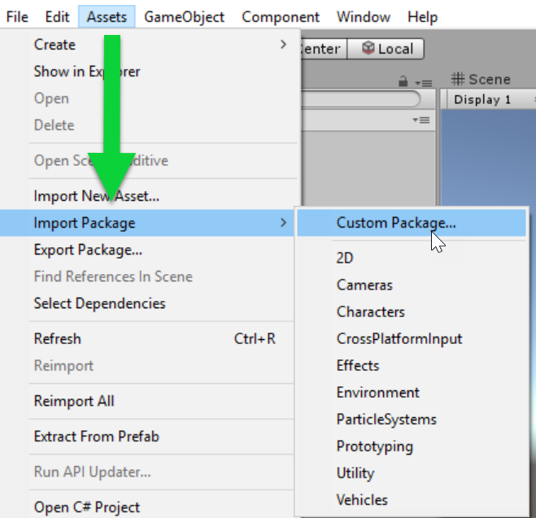
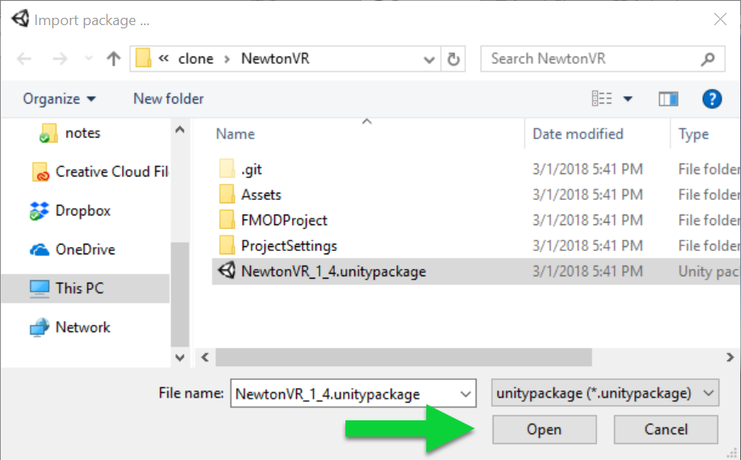
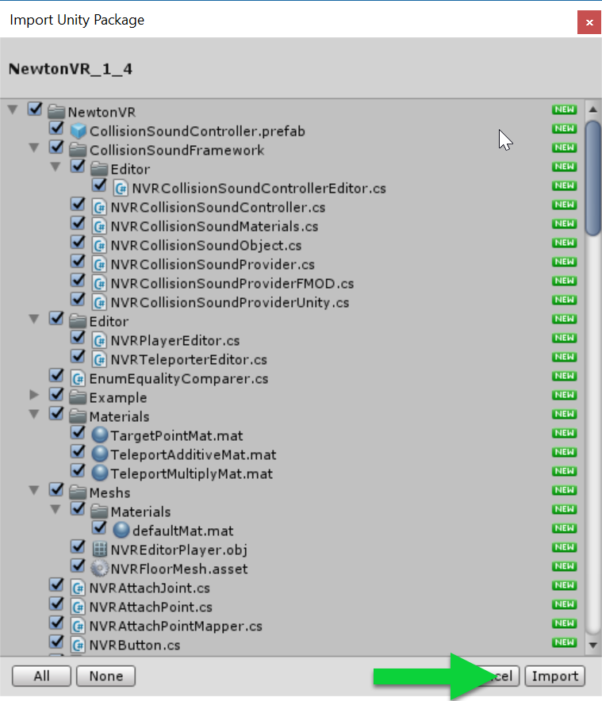
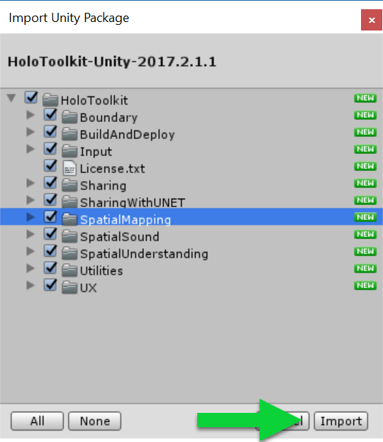
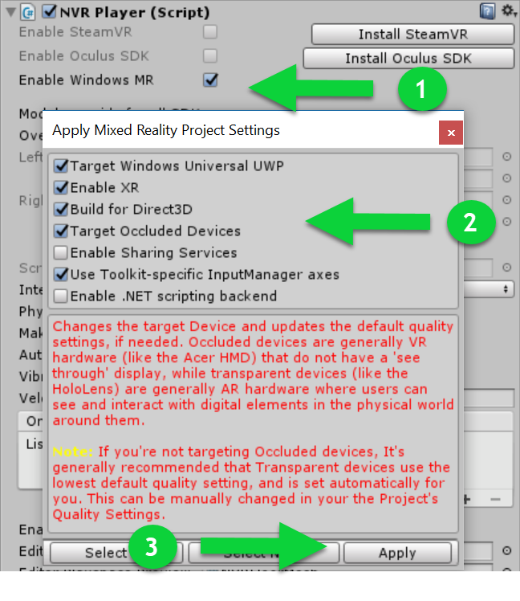
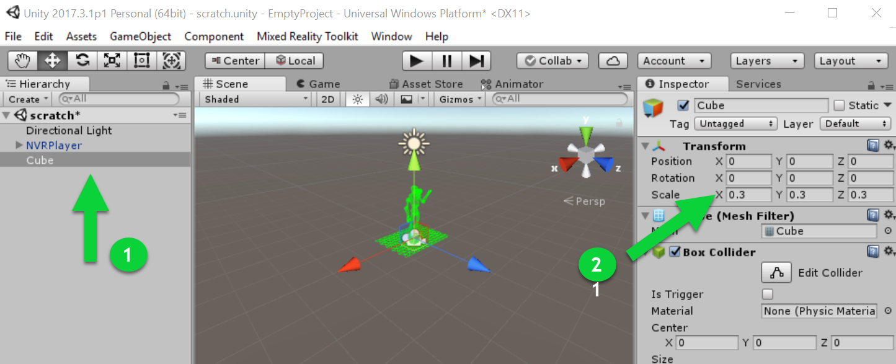
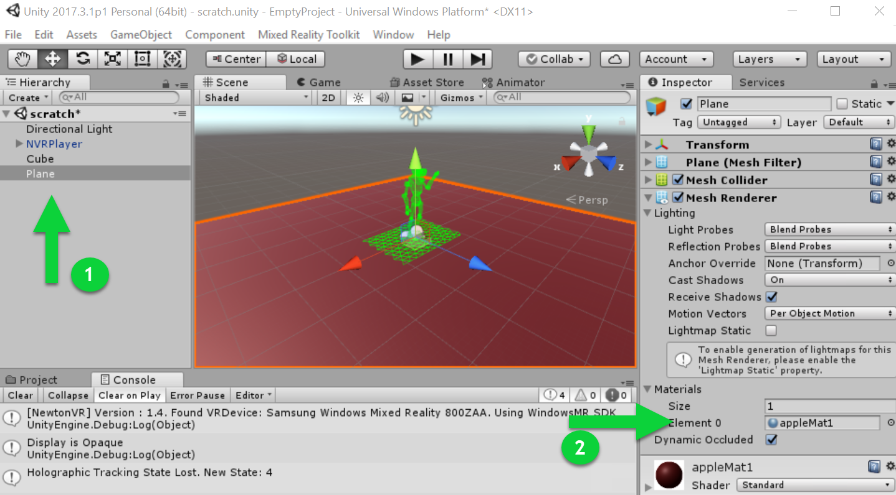

# NewtonVR 

[NewtonVR](http://newtonvr.com) is an interaction system for building VR experiences in Unity3d.  
It is free and open source; their GitHub repo is at [https://github.com/TomorrowTodayLabs/NewtonVR](https://github.com/TomorrowTodayLabs/NewtonVR). 

Newton supports motion controller interactions like grab, drop, throws, etc.  
The physics for the interactions are mass-based. You can read more on this approach from this [article](http://www.vrinflux.com/newton-vr-physics-based-interaction-on-the-vive/).
 
## Platforms/SDKs supported
Oculus Rift, SteamVR, and Windows Mixed Reality.

## Features supported     
- Hands Interactions: grab, throw, use.
- Teleporting & pointers 
- Supports a few 3D controls & physical UI elements (e.g. button, switch, lever, letter spinner) 
- Basic Unity UI (Canvas) input module
- Collision Sound framework 

## Windows MR getting started walkthrough (15-20 minutes) 
Their getting started docs have not been updated to include Windows MR, so here is a brief write-up, though most people will not needed. As you will see below, using Newton with Windows MR is straigth forward. 

### Importing the packages 
1. Create a new Unity project, or open your existing one	. 
2. You will need to get NewtonVR version 1.4 or later.   
Today, you can do that by cloning from GitHub, since Unity Asset store has an older version.   
**git clone https://github.com/TomorrowTodayLabs/NewtonVR**  
Note: Cloning the project downloads the source code and a Unity package is downloaded too. If you prefer not to clone, get package directly from repo as a file download. 
3. Import the NewtonVR package into your Unity project.  

	**In Unity, select Assets -> Import Package -> Custom Package**

      

	**Navigate to the location where you downloaded the .unitypackage file, Select it and click Open** 
 
      

	**Leave all the files selected, and click Import** 
   
      

3. **Download the latest Windows Mixed Reality Toolkit package from [the github packages folder](https://github.com/Microsoft/MixedRealityToolkit-Unity/tree/master/External/Unitypackages)**
 
4. **Import the Mixed Reality Toolkit package by repeating the three prior steps but this time with the MRTK package.**   

      

At this point, we are ready to go. Let's try the sample scene from NewtonVR.

### Running the sample scene 

1. **Open the NewtonvR\Example\NVRExampleScene scene**  
2. **Select the NVRPlayer in the hierarchy**   
3. **In the inspector, perform these three operations:**  
	1.**Check the Enable Windows MR property in NVRPlayer script**  
	2. **Set your project settings (explanations below)**  
	3. **Click Apply.**

    

Here is an explanation of these settings:   
- *Targeting Windows Universal UWP* will switch your target platform in Build Settings to target Universal Windows Platform*   
- *Enable XR* will set the Player Settings-> XR Settings to Enable Virtual Reality and will enable Windows Mixed Reality Devices.   
- *Build for Direct3D* will just set the right project for Universal Apps that target immersive (VR) headsets  
- Use Toolkit specific Inputmanager axis will set your project's InputManager settings to settings that can support Xbox controller   

With these settings in place, we are ready to go.   
Turn on your headset, controllers, and hit play in the Unity Editor. Try all the interactions.  

 

### Creating a new empty scene and integrating NewtonVR 
Creating a new scene is as easy as running the previous example, but let's still do it for the skeptics. 

1. **Create new Scene**  
2. **Drag the NVRPlayer.prefab from NewtonVR folder**  
[Note: The prefab is in the root folder, not inside a prefabs folder] 
3. Add a new cube to the scene 
	1. **GameObject->3D Object->Cube** 
	2. **Set the cube scale to 0.3, 0.3, 0.3** 
	3. **Ensure the Cube's position to 0,0,0 (our origin)** 

	  
4. Add a floor to our scene 
	1. **GameObject->3D Object ->Plane** 
	2. **Set the plane's Mesh Renderer material to something nice, like the appleMat1 from NewtonVR**  
	
	  

5. Now you are ready to run the scene.  
  **Click the Play button in the Unity Editor**  
  **Notice that your controllers render automatically**   
  **Press the trackpad button on the controllers to teleport around the scene, relative to our cube (at the origin)** 

  

## Other resources    
[NewtonVR documentation](https://newtonvr.readme.io/)
