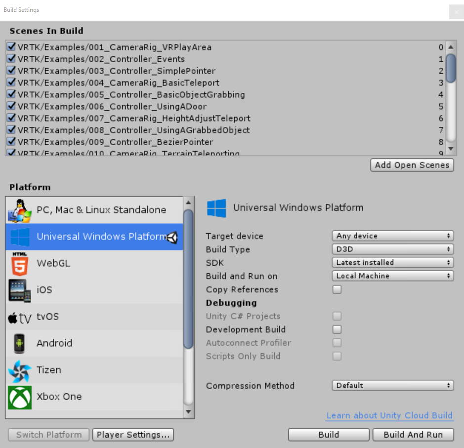
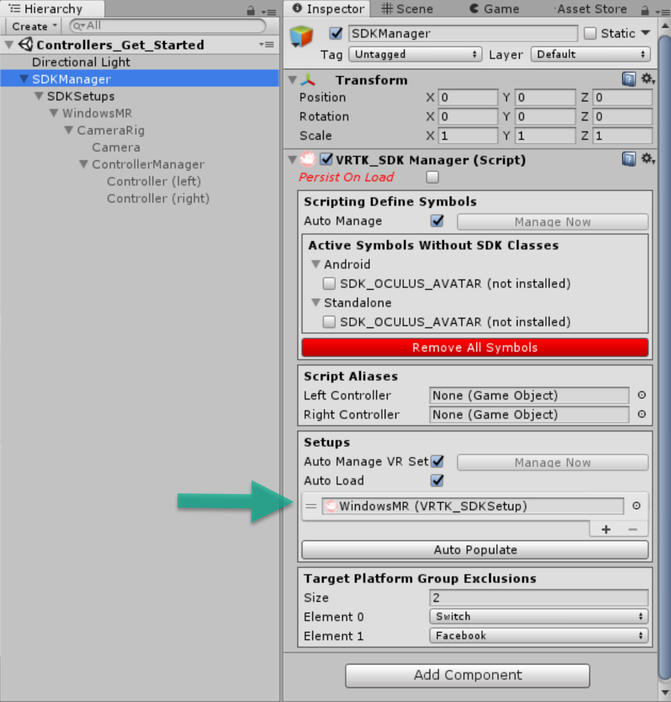
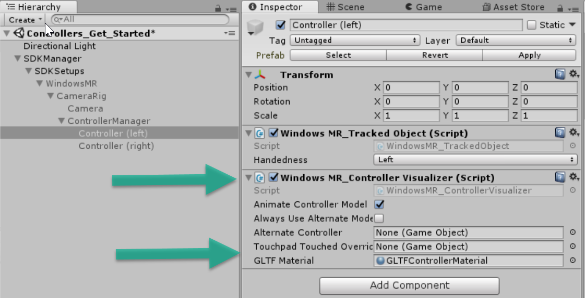
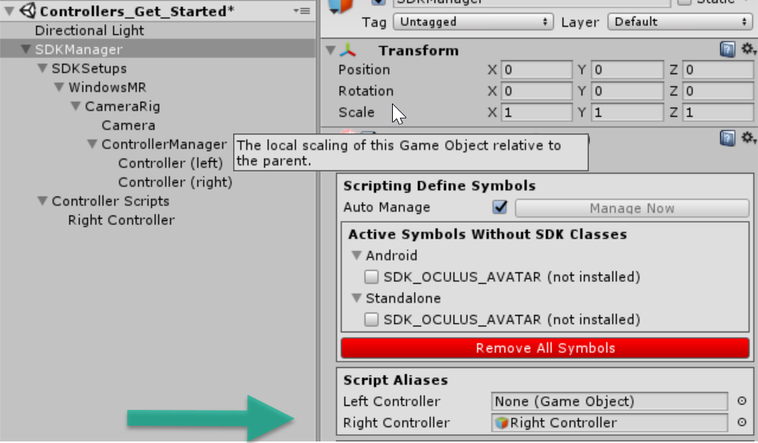
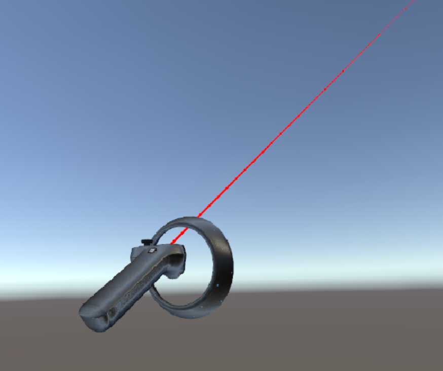
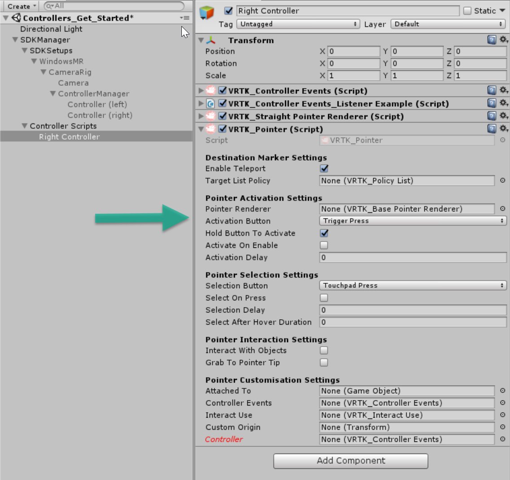

# VRTK

VRTK is a VR Toolkit for rapidly building VR solutions in Unity3d. [http://vrtk.io](http://vrtk.io "http://vrtk.io").   
It has platform agnostic implementations of different motion controller interactions and patterns that work across many VR SDKs.   

## Platforms/SDKs supported: 
**SteamVR, Oculus Rift, Daydream, and Ximmerse** are supported in the  main repo [(https://github.com/thestonefox/VRTK)](https://github.com/thestonefox/VRTK).   

***Windows Mixed Reality***   
Upcoming Windows MR support via [https://github.com/innoactive/IA-unity-VR-toolkit-VRTK/tree/feature/windows-mixed-reality-refactoring](https://github.com/innoactive/IA-unity-VR-toolkit-VRTK/tree/feature/windows-mixed-reality-refactoring). To go along with this repo, you need 
the Windows MR extension SDK for VRTK from  [https://github.com/Innoactive/VRTK-Windows-MR-Extension/tree/release/vrtk-3.3.0-alpha](https://github.com/Innoactive/VRTK-Windows-MR-Extension/tree/release/vrtk-3.3.0-alpha).   
_With both of these repos, pay attention to the specific branch._ 

## Features supported in VRTK 
- Controller Events 
- Interactions via Pointer
- Touching and grabbing objects
- 2D and 3D controls (e.g. doors, levers) 
- Locomotion within a virtual space 
- More... 

## Getting started
The main repo links to a simple [Getting Started](https://github.com/thestonefox/VRTK/blob/master/GETTING_STARTED.md) that shows you how to bootstrap a platform.  The below (Windows MR specific) getting started and give you a detailed introduction to bootstrapping platform, and from there on looking at the rich plethora of samples in the toolkit shall be all you need.   

## Windows MR getting started walkthrough  (~15-20 mins) 
1. Clone the windows-mixed-reality-refactoring from Innoactive's VRTK fork  
	**git clone https://github.com/Innoactive/IA-unity-VR-toolkit-VRTK --branch feature/windows-mixed-reality-refactoring**

1. Clone the release/vrtk-3.3.0-alpha from the Extensions repo  
**git clone https://github.com/Innoactive/VRTK-Windows-MR-Extension --branch release/vrtk-3.3.0-alpha** 

1. [Temporary step, issue has been reported]   
The extensions repo right now is not including the required DLLs. I assume their .gitignore is filtering them. The easiest way to add them is to copy them from the mixed reality toolkit for unity.
I am including the git bash command line steps. This assumes you cloned the three repos to the same root folder. You can use Windows Explorer drag & drop if you prefer that over command line.  

	**git clone github.com/microsoft/mixedrealitytoolkit-unity**  
 
	**cp -rv mixedrealitytoolkit-unity/Assets/HoloToolkit/Input/Plugins/ VRTK-Windows-MR-Extension**

	**cp -rv mixedrealitytoolkit-unity/Assets/HoloToolkit/Utilities/Scripts/GLTF/Plugins VRTK-Windows-MR-Extension/GLTF** 

1. Open the VRTK project (cloned in step 1 above) in Unity Editor. 
1. Use Windows Explorer to drag  & drop the extensions folder (cloned and completed in the steps 2-3 above) to the Assets folder.   
 	  
1. Switch target platform in Unity to _Universal Windows Platform_. 
	Don't forget to click the **Switch Platform** button after you select the platform. 
 
1. Add Windows Mixed Reality Support in Player Settings

Next, I am going to give you steps to create a Windows scene from scratch and add motion controller support to it. 

I like to create a new folder in Unity, so I can keep our code separate from the SDKs. In this case, I will call the folder "My explorations" and add a subfolder called ControllerGetStarted, where we will create our new empty scene.  

1. **Delete the Main Camera object from our empty scene** 
1. **Add a new empty GameObject to the hierarchy, call it _SDKManager_** 
1. **Add the _VRTK\_SDKManager_ component to our _SDKManager_ GameObject** 
1. **Add a new empty GameObject as a child to SDKManager, call it _SDKSetups_**
1. **Drag the _WindowsMR_ prefab(from VRTK/Source/SDK/WindowsMR folder)into hierarchy as a child of the _SDKSetups_ GameObject**  
1. **Set the _Quick Select_ and all _Detailed Selection_ properties in our VRTK_SDKSetup component to _Windows MR_**   
	Here is a quick snapshot showing the objects your scene hierarchy should have right now. It also has the inspector properties for WindowsMR: 
  
1.  **In the Hierarchy panel, select the _SDKManager_ game object and add Windows MR to the _Setups_ in the VRTK_SDKManager component** 
  
1. [This step might not be needed later when VRTK references to Windows MR extensions are streamlined]. In the hierarchy, select the Controller(left) or Controller(right) game objects (in WindowsMR\ControllerManager), and notice that they have a broken script reference; this should be a reference to _WindowsMR\_ControllerVisualizer_, located in the Extensions folder.  
**Remove the broken script reference in the Controller(xxxx) objects**  
**Add a component reference to _WindowsMR\_ControllerVisualizer_**
**Set the GLTF Material property to _GLTFControllerMaterial_ from \*_Extension/Materials folder.**  
**Ensure you have fixed both controllers (repeating steps above if needed)**   
  
If you want a quick thrill, run the app now in Unity Editor, and you will see your controller rendering, but right now it does not do much. No pointing, no teleporting, etc. Keep going to add some of these features to our scene.   
1. **Add a new empty GameObject to our scene (at root level as sibling of SDKManager, call it _Controller Scripts_**  
2. **Add an empty game object as child to our Controller Scripts object, call it _Right Controller_**    
This object will contain our scripts to interact w/ controllers. You may be wondering why not add it to the _Controller(right)_ object we added earlier, under SDKSetup; those SDKSetup children objects are Windows MR specific; by adding a new decoupled game object, we can add functionality that works across many SDK setups. That is the value of VRTK, the reusable, platform agnostic implementation.  
2.  **Set the _Right Controller_ property in the _Script aliases_ section in our SDKManager GameObject to a reference to our newly added _Right Controller_ GameObject.**  
 
This alias abstraction is what allows our controller to work across multiple SDKs (if we later add support for Steam, Rift, etc.).  
3.  **Add a _VRTK\_ControllerEvents_ to our _Right Controller_ GameObject**
3.  **Add a _VRTK\_ControllerEvents\_ListenerExample_ to the _Right Controller_ GameObject**  
If you save the scene and run it in the Unity Editor right now (with your headset and right controller on), you will see debug log for all controller events.  
4. **Add a _VRTK\_Pointer_ to our _Right Controller_ GameObject**
5. **Add a _VRTK\_StraightPointerRenderer_ to our _Right Controller_ GameObject**

Save the scene and run it; you will now see that your right controller has a pointer  that gets enabled when you press the touchpad. Not bad for not having written a single line of code. 

  

From here, you can explore on your own. I recommend you to:  
1. Change the Activation Button property in VRTK_Pointer to _Trigger Press_ so that the controller is closer to Windows MR conventions.  
2. Repeat the last steps above and add all the functionality for your Left Controller. Here is what the _Right Controller_ object looks like.
     
3. Play with the other samples in VRTK, there is a myriad of features we did not cover.  If you are using Windows MR controllers, you might need to fix the references in the sample like we did in this write-up; good thing you are an expert now. ;)  
4. Play with adding support for other platforms so you can see that the code works across these platforms without any changes; all you need is a proper SDKSetup. If you don't have a different headset, use the VRTK simulator as a platform. 

## Other Useful Resources  
- The Slack Community for VRTK is at [http://invite.vrtk.io/](http://invite.vrtk.io/) 
- Very useful VRTK Youtube channel is at [https://www.youtube.com/channel/UCWRk-LEMUNoZxUmY1wO7DBQ ](https://www.youtube.com/channel/UCWRk-LEMUNoZxUmY1wO7DBQ).
 
